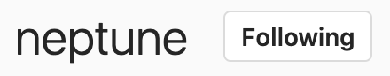

# README

## Live: [Posergram](https://posergram.herokuapp.com "Posergram")

Posergram is a full-stack single-page photo sharing social networking web application based on [Instagram](https://www.instagram.com/ "Instagram"). Users can browse through, like and/or comment on other users' photos. Users can follow other users to add content to their feed, and amass followers themselves.


# Technologies

`Posergram` is built using primarily React and Redux for the frontend, along with HTML and CSS, Ruby on Rails and a PostgreSQL database for the backend, and Amazon Web Services S3 for file storage.

# Feature highlights

## Authentication

Model level validations ensure that users signup with a unique username and password with a minimum of 8 characters. User passwords are protected via hashing + salting, done by BCrypt, allowing for a passport digest to be stored to the database rather than the password itself. Users' session times are also preserved through the use of session tokens (cookies). Only users who are successfully logged in can take advantage of Posergram's features.

```ruby
class User < ApplicationRecord
    validates :username, :session_token, :password_digest, presence: true
    validates :username, :session_token, uniqueness: true
    validates :password, length: {minimum:8}, allow_nil: true
    after_initialize :ensure_session_token
```
```ruby
    def password=(password)
        @password = password
        self.password_digest = BCrypt::Password.create(password)
    end

    def is_password?(password)
        bcrypt_pw = BCrypt::Password.new(self.password_digest)
        bcrypt_pw.is_password?(password)
    end
```

```ruby
class Api::PostsController < ApplicationController
    before_action :ensure_login
```

## Feed

Posergram's main feature is being able to share photos and see photos of other users. Users feed is populated by their own posts as well as posts of the users they follow. The feed is populated in chronological order, with the most recent posting at the top.


## Profile

Users can navigate to their personal profile by clicking on the profile icon. Their total number of posts is displayed by their username. From there, they may view each of their own posts individually, via a modal after clicking on a post, delete a post, create a post, edit their profile information and avatar or navigate back to their feed by clicking on the logo icon on the left in the navigation bar.


## Following

Users can follow other users. By doing so, they will have access to thir posts in their feed. Users can also unfollow other users. By doing so, they will lose access to their posts. Follows are created using Rails Model-level Associations, simplifying database querying.




```ruby
    has_many :following_relationships,
    foreign_key: :follower_id,
    class_name: :Follow,
    dependent: :destroy

    has_many :follower_relationships,
    foreign_key: :user_id,
    class_name: :Follow,
    dependent: :destroy

    has_many :followings,
    through: :following_relationships,
    source: :following

    has_many :followers,
    through: :follower_relationships,
    source: :follower
```


## Post Create

Clicking on the heart icon opens up a post form, accomplished by rendering a modal component, that includes an optional caption input and a mandatory photo input. Once a file is chosen, the photo is previewed on screen before submission, using JavaScript's FileReader. The optional caption can be editted later by clicking on the edit icon on the post. After submission, users are taken to their feed,which is updated with their new post. Photo storage is handled by Amazon Web Services S3, allowing the website to run faster by not saving the images into the website itself.


```javascript
    handleFile(e) {
    
    const reader = new FileReader();
    const file = e.currentTarget.files[0];
    reader.onloadend = () => {
        this.setState({ imageUrl: reader.result, 
                        imageFile: file,
                        disabledOrNot: false
                    });
                };

    if (file) {
        reader.readAsDataURL(file);
    } else {
        this.setState({imageUrl: "", imageFile: null });
    }
}
```

```javascript
    render() {
        if (this.state.modalOpen) {
            this.uploadForm = <UploadPostContainer/>
        } else {
            this.uploadForm = null;
        }
```


## Comments and Likes

Users may like or unlike a photo by clicking on the heart under the image. The like count is displayed under each photo. Users may comment on any photo and delete only their comments, by clicking on the trash can icon next to their comment.


Comment deletion is handled by a simple condition to check whether the `currentUser` is the owner of a comment. An `onClick` handler function invokes the delete function only when the condition is met.

```javascript
{(this.props.currentUserId === comment.user_id) ? deleteComm(comment.id) : ""}


const deleteComm = (commentId) => {
                return (
                    <div className="delete-comm-butt">
                        <button className="delete-comm-x" onClick={this.handleDeleteComment(commentId)}><i className="far fa-trash-alt"></i></button>
                    </div>
                )
            } 
```

# Future Implementations
* Video Upload
* Location Tag
* Hashtags
* Filters